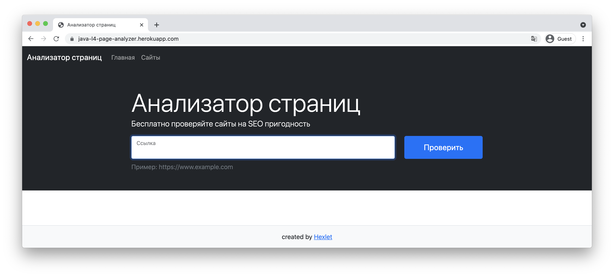

### Hexlet tests and linter status:

### Проект модуля #4
# Анализатор страниц

### Цель
Четвёртый проект – полноценный веб-сайт на базе фреймворка Javalin. Здесь отрабатываются базовые принципы построения современных сайтов на MVC-архитектуре: работа с роутингом, обработчиками запросов и шаблонизатором, взаимодействие с базой данных через JDBC.

Независимо от используемого способа написания кода, вся веб-разработка (бэкенд) базируется на двух вещах: протоколе HTTP и клиент-серверной архитектуре, которые изучаются в соответствующих курсах. Любое обращение к сайту это HTTP-запрос, а результат который мы видим это HTTP-ответ. Эти понятия составляют основу любого фреймворка и изучаются в первую очередь. В свою очередь роутинг завязан на методах HTTP и использует их для формирования конкретных маршрутов. Часто на собеседовании спрашивают: "Что происходит, когда пользователь набирает в браузере адрес сайта и нажимает Enter?". После проекта ответ на этот вопрос станет очевидным из собственного опыта.

Код — это только часть сайта. В конечном итоге имеют значение данные, которые лежат в базе данных. А для этого её сначала нужно правильно спроектировать. Здесь понадобятся знания нормальных форм и принципов построения отношений между сущностями

И даже бэкенд разработка не может существовать без фронтенда. У любого сайта есть стили и хотя бы минимальный JavaScript, а в шаблонах на полную катушку используется HTML. В этом проекте студентам предстоит познакомиться с Bootstrap и использовать его компоненты для визуального оформления.

Профессиональная разработка не обходится без автоматизированного тестирования. Тестирование сайтов сильно отличается от тестирования кода библиотек. Оно, в основном, строится вокруг тестов, имитирующих HTTP-запросы и проверяющих ответы вместе с данными в базе. Подобные тесты позволяют дёшево проверять работоспособность приложения и обеспечивают легкий рефакторинг в будущем. На проекте оттачивается навык написания подобных тестов, который пригодится и в других фреймворках.

Кроме кода сайта, веб-разработка включает в себя важные инфраструктурные элементы, для запуска сайта нужен веб-сервер и установленная база данных. В свою очередь работа по сети опирается на базовое понимание работы протокола TCP и знакомство с понятием ip-адреса и порта. Со всем этим придётся столкнуться в процессе разворачивания локального окружения.

Когда сайт готов, его нужно выложить в публичный доступ или, как говорят программисты: «задеплоить в продакшн». Выкладка готового кода — неотъемлемая часть разработки. Существует множество различных подходов и требований к тому как это делать эффективно. В этом проекте отрабатывается наиболее автоматизированный способ, с помощью сервиса Render. Это хостинг, работающий по модели PaaS (платформа как сервис), он сам отвечает за инфраструктуру и требует определённого способа организации кода для обеспечения масштабируемости.

### Описание
[Page Analyzer](https://java-page-analyzer-ru.hexlet.app) – сайт, который анализирует указанные страницы на SEO пригодность.

